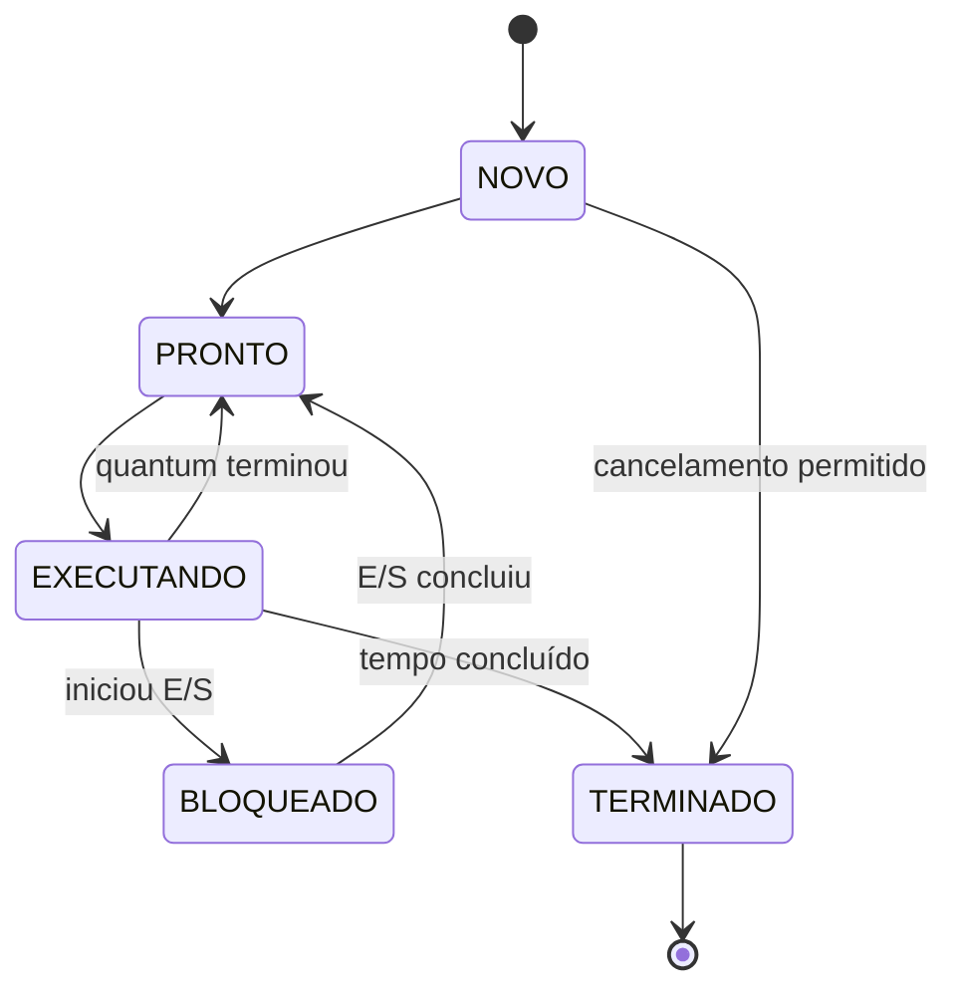

# Arquitetura e Design

## 1. Estilo arquitetural

A aplicação usa uma arquitetura modular em camadas simples:

```text
Interface de terminal
        |
Controlador da simulação
        |
Processos | Escalonador | Memória | E/S | Arquivos | Recursos | Semáforos
        |
Logs e Estatísticas
```

O `main.c` deve coordenar o fluxo da aplicação, enquanto cada módulo deve controlar seu próprio estado e expor apenas funções necessárias por meio de `.h`.

## 2. Componentes previstos

| Componente | Responsabilidade |
| --- | --- |
| Interface | Ler comandos, validar entrada e exibir resultados |
| Processos | Criar, consultar, alterar estado e finalizar processos |
| Escalonador | Fila de prontos, quantum e seleção Round Robin |
| Memória | Blocos, First Fit, liberação e união de espaços livres |
| E/S | Bloqueio, duração lógica e retorno à fila |
| Arquivos | Diretório, conteúdo, abertura, leitura e escrita simuladas |
| Recursos | Posse e disponibilidade de impressora, disco e fita |
| Semáforos | Operações P e V e exclusão mútua simuladas |
| Logs | Histórico cronológico das operações |
| Estatísticas | Contadores e indicadores da simulação |

## 3. Regras de dependência

- A interface pode chamar os serviços dos módulos, mas não deve manipular diretamente seus vetores internos.
- O escalonador depende do módulo de processos para atualizar estados.
- A finalização de processo deve acionar a liberação de memória, arquivos abertos e recursos.
- Logs e estatísticas devem receber eventos dos serviços, não duplicar regras de negócio.
- Cabeçalhos devem conter tipos, constantes e protótipos; implementações ficam em `.c`.
- Variáveis globais, quando inevitáveis, devem ser declaradas com `extern` no cabeçalho e definidas uma única vez.

## 4. Fluxo principal

1. Inicializar logs, estatísticas, processos, memória e demais módulos.
2. Exibir o menu ou iniciar a simulação automática.
3. Validar a opção escolhida.
4. Executar a operação do módulo responsável.
5. Registrar o evento e atualizar estatísticas.
6. Exibir resultado e retornar ao menu.
7. Encerrar somente após liberar ou invalidar os estados simulados de forma controlada.

## 5. Máquina de estados de processo



## 6. Decisões de design

- A fila de prontos é circular para reaproveitar posições do vetor.
- A memória utiliza blocos variáveis e First Fit.
- O tempo é lógico e avançado pelos eventos da simulação.
- Retornos inteiros indicam sucesso ou falha nas funções de baixo nível; a interface transforma esses retornos em mensagens compreensíveis.
- O sistema deve preferir operações determinísticas para facilitar as aulas e os testes.

## 7. Tratamento de erros

Cada função deve validar ponteiros, identificadores, limites e pré-condições antes de modificar o estado. Em caso de erro, deve retornar código de falha e preservar o estado anterior sempre que possível.
